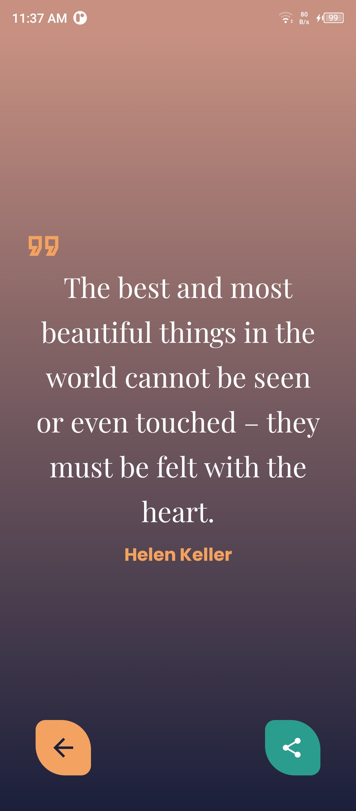

# ✨ Random Quote Generator App – Discover & Share Inspiration

A clean and interactive quote app that displays random motivational or thoughtful quotes, allows users to generate new ones, and share their favorites.

---

📱 Features

- Display random quotes with authors  
- Elegant fade animations  
- Share to social media or messaging apps  
- Fully themed with custom colors and fonts  

---

📸 Screenshots

  
  

---

🧰 Tech Stack

`Java` · `Android SDK` · `SharedPreferences` · `Material Design` · `XML` · `ConstraintLayout`

---

🛠️ Contribution

This project is currently closed source. Contributions, forks, or reuse of any part of the code are not permitted without prior written permission.

---

🔒 License

© 2025 Ramzy Ahmed. All rights reserved.

This project is protected by copyright law.

Any unauthorized use, reproduction, modification, or distribution of the code or any part of this project is strictly prohibited without the explicit written permission of the author.

---

## 🙌 Author

Developed with passion by **Ramzy Ahmed**  
Feel free to connect on [LinkedIn](https://www.linkedin.com/in/ramzy-ahmed)

